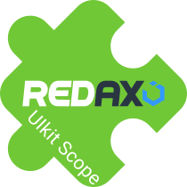

[](https://github.com/lapicidae/uikit_scope)

# REDAXO Addon: UIkit Scope

Das UIKit Scope Addon für REDAXO erweitert das CMS um eine flexible Integration des UIkit-Frameworks ins Redaxo-Backend. Dies wird durch die Nutzung des [Scope Mode](https://getuikit.com/docs/avoiding-conflicts#scope-mode) von UIkit erreicht, wodurch Konflikte mit bestehenden Backend-Stilen vermieden werden.

## Funktionen

  * **Scope Mode**: UIkit-Elemente können im Backend ohne Stil- oder Funktionskonflikte genutzt werden.
  * **REDAXO-Variablen**: Ausgabevariablen zur einfacheren Kapselung von UIkit-Inhalten.
  * **Eigene UIkit-Quellen einbinden**: Möglichkeit, eigene UIkit-JavaScript- und CSS-Dateien zu verwenden.
  * **YForm-Templates**: Die enthaltenen YForm-Templates ermöglichen einen schnellen Start bei der Erstellung von Formularen.

## Installation

 1. Das Addon in den REDAXO /addons/-Ordner hochladen.
 2. Im REDAXO-Backend unter System > Addons das Addon installieren und aktivieren.
 3. Die Konfiguration nach Bedarf anpassen.

## REX_UIKIT_SCOPE Variable

Diese Variable hilft dabei, UIkit-spezifische Inhalte im REDAXO Backend korrekt anzuzeigen.

### Verwendung

#### In einem Redaxo-Template oder Modul

Die Variable kann direkt in einem Modul oder Template genutzt werden:

```html
REX_UIKIT_SCOPE[start]
<p>Dieser Inhalt liegt innerhalb des UIkit-Scope.</p>
REX_UIKIT_SCOPE[stop]
```

#### Direkter Aufruf in PHP

Falls du die Funktionalität direkt in PHP nutzen möchtest, kannst du die *scope()*-Methode verwenden:

```php
echo rex_var_uikit_scope::scope('start');
echo '<p>Dieser Inhalt liegt innerhalb des UIkit-Scope.</p>';
echo rex_var_uikit_scope::scope('stop');
```

#### Ausgabe (nur im Backend)

```html
<!-- REX_UIKIT_SCOPE[start] -->
<div id="uk-scope-xyz123" class="uk-scope">
    <p>Dieser Inhalt liegt innerhalb des UIkit-Scope.</p>
</div>
<!-- REX_UIKIT_SCOPE[stop] -->
```

#### Unterstützte Parameter

| Parameter               | Beschreibung                             |
|-------------------------|------------------------------------------|
| `start` / `begin`       | Öffnet einen neuen Scope (div-Container) |
| `stop` / `end` / `exit` | Schließt den Scope                       |

## YForm-Templates

Alle für das Frontend relevanten Templates wurden für UIkit optimiert. Nicht für das Frontend relevante Elemente verwenden weiterhin die YForm-Bootstrap-Templates.

### YForm Formbuilder

#### Aktivierung

```text
objparams|form_ytemplate|uikit,bootstrap
```

Der Fallback-Parameter *bootstrap* ist wichtig um eine fehlerfreie Funktion sicherzustellen.

#### Parameter (optional)

[Gestapelte Anordnung](https://getuikit.com/docs/form#layout)

```text
objparams|form_class|uk-form-stacked
```

[Horizontale Anordnung](https://getuikit.com/docs/form#horizontal-form)

```text
objparams|form_class|uk-form-horizontal
```

## Links

  * [UIkit](https://getuikit.com/)
  * [REDAXO](https://redaxo.org/)
  * [Friends Of REDAXO](https://friendsofredaxo.github.io/)
  * [YForm](https://github.com/yakamara/yform)
