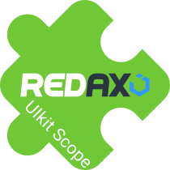

[](https://github.com/lapicidae/uikit_scope)

# REDAXO Addon: UIkit Scope

The UIKit Scope addon for REDAXO extends the CMS with a flexible integration of the UIkit framework into the REDAXO backend. This is achieved by using UIkit's [Scope Mode](https://getuikit.com/docs/avoiding-conflicts#scope-mode), which prevents conflicts with existing backend styles.

## Features

  * **Scope Mode**: UIkit elements can be used in the backend without style or functionality conflicts.
  * **REDAXO Variables**: Output variables for easier encapsulation of UIkit content.
  * **Custom UIkit sources**: Allows the use of custom UIkit JavaScript and CSS files.
  * **YForm templates**: The included YForm templates provide a quick start for creating forms.

## Installation

 1. Upload the addon to the REDAXO `/addons/` folder.
 2. In the REDAXO backend, go to **System > Addons**, install and activate the addon.
 3. Adjust the configuration as needed.

## REX_UIKIT_SCOPE Variable

This variable helps to display UIkit-specific content correctly in the REDAXO backend.

### Usage

#### In a REDAXO template or module

The variable can be used directly within a module or template:

```html
REX_UIKIT_SCOPE[start]
<p>This content is inside the UIkit scope.</p>
REX_UIKIT_SCOPE[stop]
```

#### Direct call in PHP

If you want to use the functionality directly in PHP, you can call the *scope()* method:

```php
echo rex_var_uikit_scope::scope('start');
echo '<p>This content is inside the UIkit scope.</p>';
echo rex_var_uikit_scope::scope('stop');
```

#### Output (only in the backend)

```html
<!-- REX_UIKIT_SCOPE[start] -->
<div id="uk-scope-xyz123" class="uk-scope">
    <p>This content is inside the UIkit scope.</p>
</div>
<!-- REX_UIKIT_SCOPE[stop] -->
```

#### Supported parameters

| Parameter               | Description                       |
|-------------------------|-----------------------------------|
| `start` / `begin`       | Opens a new scope (div container) |
| `stop` / `end` / `exit` | Closes the scope                  |

## YForm Templates

All frontend-relevant templates have been optimized for UIkit. Elements that are not frontend-relevant continue to use the YForm Bootstrap templates.

### YForm Formbuilder

#### Activation

```text
objparams|form_ytemplate|uikit,bootstrap
```

The fallback parameter *bootstrap* is important to ensure proper functionality.

#### Parameters (optional)

[Stacked layout](https://getuikit.com/docs/form#layout)

```text
objparams|form_class|uk-form-stacked
```

[Horizontal layout](https://getuikit.com/docs/form#horizontal-form)

```text
objparams|form_class|uk-form-horizontal
```

## Links

- [UIkit](https://getuikit.com/)
- [REDAXO](https://redaxo.org/)
- [Friends Of REDAXO](https://friendsofredaxo.github.io/)
- [YForm](https://github.com/yakamara/yform)
